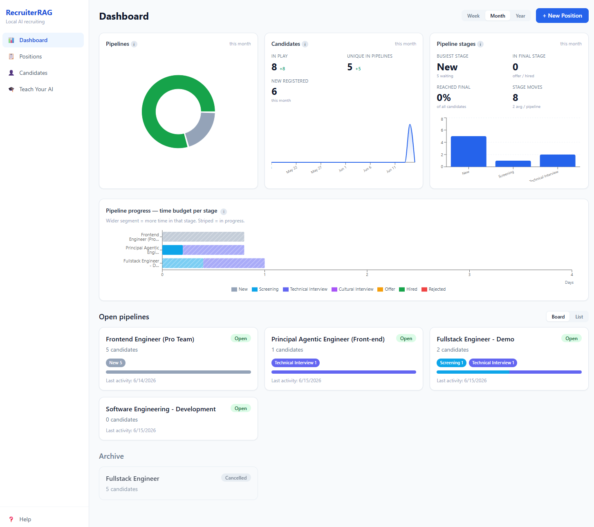
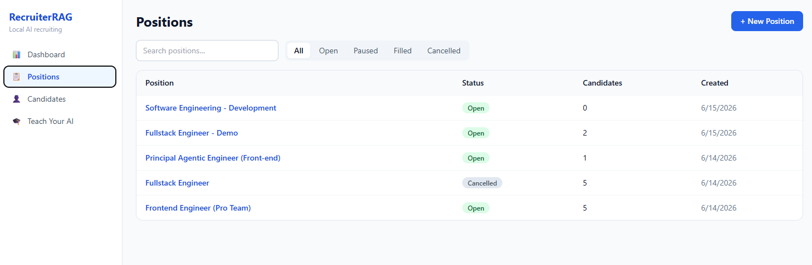
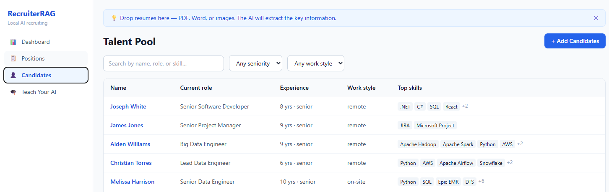
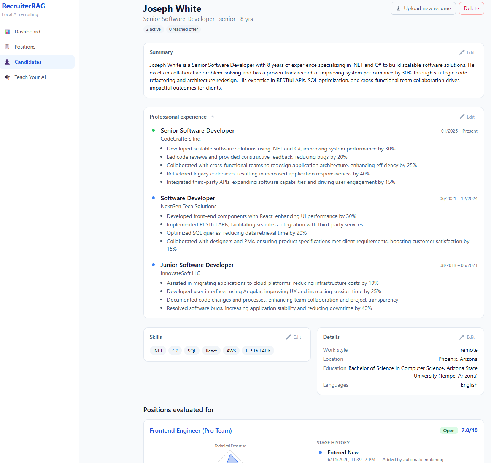
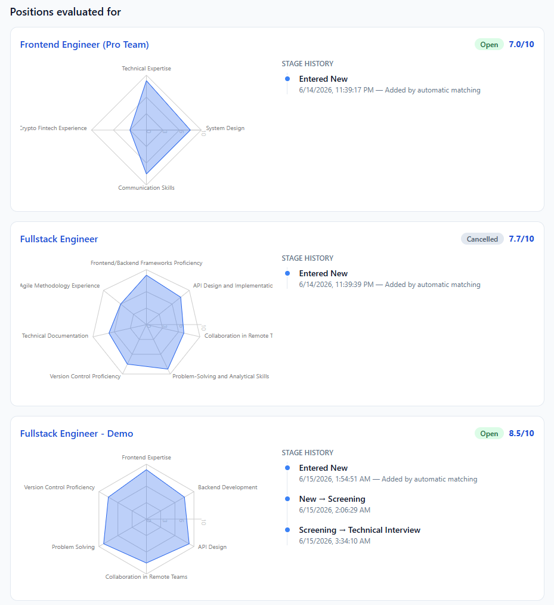
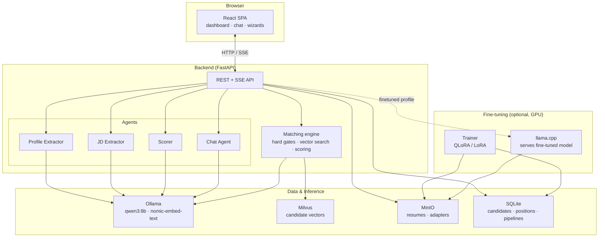
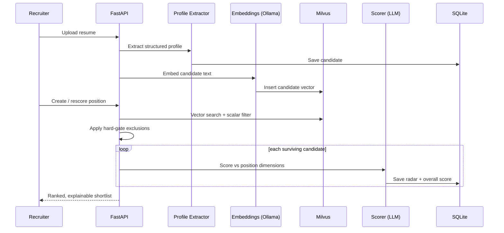

# RecruiterRAG


A fully local, AI-powered recruiting pipeline for non-technical recruiters. Upload resumes and job
descriptions — the AI extracts, scores, and ranks candidates, and you explore them through a chat
interface with live charts. No cloud accounts, no API keys. Everything runs on your machine.

> ### ⚡ Use a GPU — strongly recommended
> RecruiterRAG runs an 8B-parameter LLM locally. **On a CPU it is usably slow at best**: resume
> extraction, scoring, and chat can take minutes per request. A modern **NVIDIA GPU** (≥ 8 GB VRAM)
> makes inference near-instant.
>
> Start with the GPU overlay:
> ```bash
> docker compose -f docker-compose.yml -f docker-compose.gpu.yml up --build
> ```
> Setup details: [docs/GPU.md](docs/GPU.md). No NVIDIA GPU? The CPU path still works for
> evaluation — just expect long waits, or set `LLM_MODEL=qwen3:4b` in `.env` to soften it.



## Quick Start (5 steps)

1. **Install [Docker Desktop](https://www.docker.com/products/docker-desktop/)** (Windows needs WSL2 enabled).
2. **Clone and start** (GPU path — recommended, see the callout above):
   ```bash
   git clone <repo-url> recruiterrag
   cd recruiterrag
   docker compose -f docker-compose.yml -f docker-compose.gpu.yml up --build
   ```
   No NVIDIA GPU? Use the CPU fallback: `docker compose up` (expect slow inference).
3. **Wait for the first-run model download** (Qwen3 8B + embeddings, ~6 GB — one time only).
4. **Open <http://localhost:3000>** — the welcome tour starts automatically.
5. **Add candidates** (drop PDFs/Word files) and **create a position** (paste a JD). Done.

---

## Functional Overview

RecruiterRAG turns a pile of resumes and a job description into a ranked, explainable shortlist.

### Dashboard

Pipeline health at a glance: candidates in play, busiest stage, stage-move velocity, and a
time-budget-per-stage view. Open pipelines show as a board or list; cancelled ones drop to an
archive.


### Positions

Each position is created from a pasted job description. The AI extracts the role discipline,
scoring dimensions, and hard-gate exclusion rules. Filter by status (Open / Paused / Filled /
Cancelled).



### Talent Pool (Candidates)

Drop PDF, Word, or image resumes — the AI extracts name, role, experience, work style, location,
education, languages, and skills. Search and filter the pool by name, role, skill, seniority, and
work style.



### Candidate Profile

An AI-generated summary, full professional experience, skills, and details — every section
editable. The profile tracks which positions the candidate was evaluated for.



### Scoring & Stage History

For every position a candidate is matched against, RecruiterRAG produces a per-dimension radar
score (0–10) plus an overall score, and records the full stage history (New → Screening →
Technical Interview → Cultural Interview → Offer → Hired / Rejected).



### Analytics Chat

A floating chat answers questions about the pipeline and renders live charts — funnels, bars,
tables, radars, and scatter plots — instead of plain text.

### Teach Your AI (optional, needs a GPU)

After closing a few pipelines you can fine-tune the model on your own hiring decisions (QLoRA /
LoRA). See [Teaching Your AI](#teaching-your-ai-optional-needs-a-gpu) below.

---

## Technical Overview

### Architecture

RecruiterRAG is a containerized stack: a React SPA, a FastAPI backend hosting the AI agents, a
local LLM (Ollama), a Milvus vector store for semantic candidate search, and MinIO for raw file +
adapter storage. An optional trainer + llama.cpp pair adds fine-tuning.



### Candidate matching flow

When a resume is ingested or a position is (re)scored, the pipeline runs extraction → embedding →
hard gates → vector search → LLM scoring, persisting both vectors and scores.



### Services

| Service | Port | Purpose |
|---|---|---|
| `ui` | 3000 | React app (dashboard, chat, wizards) |
| `api` | 8000 | FastAPI backend + AI agents |
| `ollama` | 11434 | Local LLM inference (qwen3:8b, nomic-embed-text) |
| `milvus` | 19530 | Vector search over candidates |
| `storage` (MinIO) | 9000 | Raw file + model adapter storage |
| `llamacpp` | 8080 | Serves your fine-tuned model (profile: `finetuned`) |
| `trainer` | 8500 | Fine-tuning service (profile: `training`, needs GPU) |

### AI agents

| Agent | Input | Output |
|---|---|---|
| Profile Extractor | Raw resume text | Structured candidate profile + discipline |
| JD Extractor | Job description | Scoring dimensions + hard-gate exclusion rules |
| Scorer | Candidate + position | Per-dimension radar scores (0–10) + overall |
| Chat Agent | Recruiter question | Natural-language answer + chart spec |

### Tech stack

- **Frontend:** React + TypeScript, Vite, Tailwind CSS, Zustand
- **Backend:** FastAPI, SQLModel / SQLite, Server-Sent Events for live job progress
- **AI / data:** Ollama (qwen3:8b + nomic-embed-text), Milvus vector DB, MinIO object store
- **Fine-tuning:** QLoRA / LoRA trainer, llama.cpp inference (optional, GPU)
- **Testing:** Pytest (backend), Vitest (frontend), Playwright (end-to-end)

---

## Teaching Your AI (optional, needs a GPU)

After closing a few pipelines you can fine-tune the model on your own hiring decisions:

```bash
docker compose --profile training up -d trainer
```

Then open **Teach Your AI** in the app and follow the wizard. Requires an NVIDIA GPU with ≥ 6 GB
VRAM (QLoRA) or ≥ 16 GB (LoRA). Once an adapter is activated, start the fine-tuned inference
backend:

```bash
docker compose --profile finetuned up -d llamacpp
```

## Common Issues

| Symptom | Fix |
|---|---|
| "The AI isn't ready yet" | First run downloads ~6 GB of models. Watch `docker compose logs ollama-init`. |
| Chat / resume processing is slow | CPU inference of qwen3:8b is slow. Best fix: enable GPU ([docs/GPU.md](docs/GPU.md)). Otherwise set `LLM_MODEL=qwen3:4b` in `.env`. |
| Scanned PDFs read poorly | OCR quality depends on scan resolution. Paste the text manually if extraction looks wrong. |
| Training says "no GPU found" | The trainer needs CUDA or Apple Silicon. CPU training is not supported. |

## Privacy

All inference, storage, and processing stays on your machine. After the first model download the
app runs fully offline. MinIO credentials default to `recruiterrag`/`recruiterrag` — change them if
you ever expose the services beyond localhost.

## License

[MIT](LICENSE)
